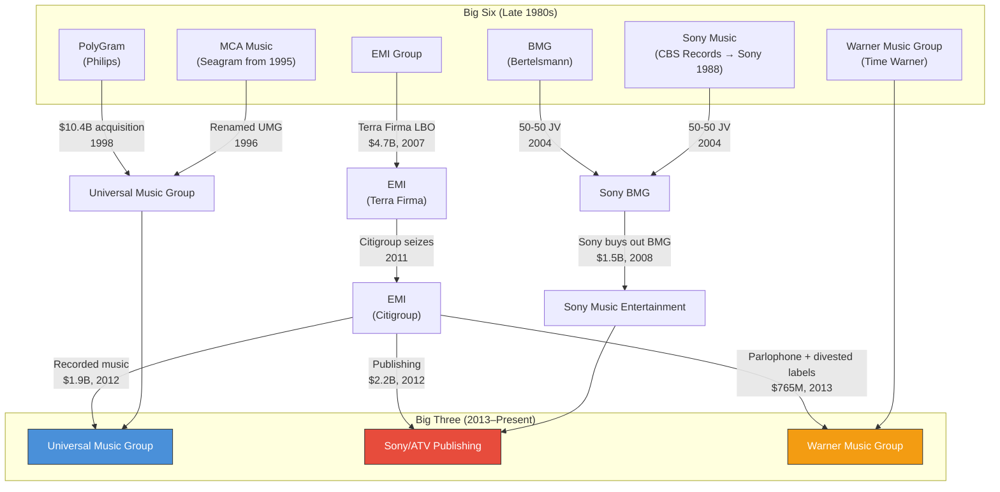
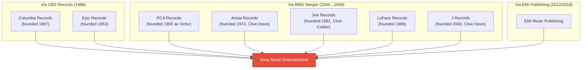
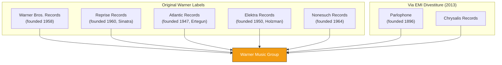
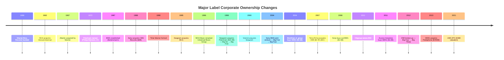

# Label Consolidation Lineage

Visual diagrams tracing the ownership history of the Big Three major label groups.

---

## The Path from Big Six to Big Three

---

## Universal Music Group — Label Lineage

```mermaid
graph TD
    subgraph "Direct Acquisitions / Organic"
        MCA_R["MCA Records<br/>(from Decca, 1962)"]
        UNI["Uni Records<br/>(1966)"]
        KAPP["Kapp Records<br/>(1967)"]
    end

    subgraph "Via PolyGram (1998)"
        AM["A&M Records<br/>(founded 1962)"]
        ISL["Island Records<br/>(founded 1959)"]
        DEFJ["Def Jam Recordings<br/>(founded 1984)"]
        MERC["Mercury Records<br/>(founded 1945)"]
        VERVE["Verve Records<br/>(founded 1956)"]
        DG["Deutsche Grammophon<br/>(founded 1898)"]
        POLY_R["Polydor Records"]
    end

    subgraph "Via MCA/Direct"
        INTER["Interscope Records<br/>(founded 1990)"]
        GEF["Geffen Records<br/>(founded 1980)"]
        MOT["Motown Records<br/>(founded 1959, acq. 1988)"]
    end

    subgraph "Via EMI (2012)"
        CAP["Capitol Records<br/>(founded 1942)"]
        VIRG["Virgin Records<br/>(founded 1972)"]
        BN["Blue Note Records<br/>(founded 1939)"]
    end

    MCA_R --> UMG["Universal Music Group"]
    UNI --> UMG
    KAPP --> UMG
    AM --> UMG
    ISL --> UMG
    DEFJ --> UMG
    MERC --> UMG
    VERVE --> UMG
    DG --> UMG
    POLY_R --> UMG
    INTER --> UMG
    GEF --> UMG
    MOT --> UMG
    CAP --> UMG
    VIRG --> UMG
    BN --> UMG

    style UMG fill:#4a90d9,stroke:#333,color:#fff
```

---

## Sony Music Entertainment — Label Lineage

---

## Warner Music Group — Label Lineage

---

## Corporate Ownership History

---

## Current Structure (2024–2025)

### Universal Music Group
| Division | Key Labels | Leader |
|----------|-----------|--------|
| East Coast (Republic Corps) | Republic Records, Def Jam, Island, Mercury | Monte Lipman |
| West Coast (Interscope Capitol) | Interscope Geffen A&M, Capitol, Motown, Verve, Blue Note | John Janick |
| Global | Polydor, Decca, Deutsche Grammophon, EMI, Virgin, Abbey Road Studios | Various |

### Sony Music Entertainment
| Key Labels | Function |
|-----------|----------|
| Columbia Records | Flagship |
| RCA Records | Co-flagship |
| Epic Records | Pop/urban |
| Legacy Recordings | Catalog |
| The Orchard | Indie distribution (26,000+ labels) |
| Sony Music Latin | Latin market |
| Sony Masterworks / Classical | Classical/crossover |

### Warner Music Group
| Division | Key Labels | Leader |
|----------|-----------|--------|
| Atlantic Music Group | Atlantic Records, 300 Elektra Entertainment, 10K Projects | Elliot Grainge |
| Warner Records | Warner Records, Reprise, Nonesuch, Warner Music Nashville | Tom Corson & Aaron Bay-Schuck |

---

*Sources: Billboard (UMG restructure 2024), Wikipedia (Sony Music labels), PR Newswire (WMG reorganization 2024)*
